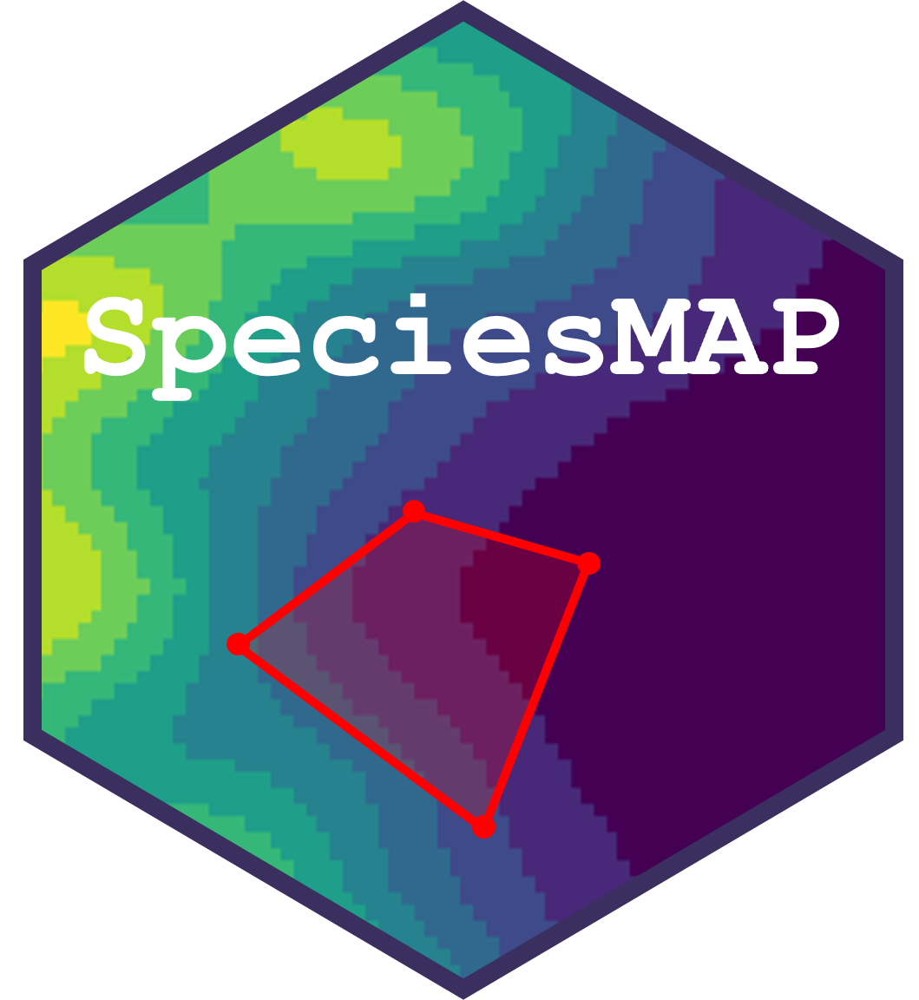

Species Mapping & Analysis Platform (SpeciesMAP)
================



A customisable R Shiny template for displaying and interrogating species
distribution data. 

Visit the GitHub repo for the latest version: https://github.com/MattIDCarter/SpeciesMAP.git


## Overview

This repository provides a basic framework for developing a Shiny
application to display species distribution estimates and allow users
to define an Area of Interest (AOI) and extract estimates of density within that AOI.

The template is deliberately designed to be adaptable to different datasets. Dataset-specific 
components should be defined in `config/config.R` and the
associated data functions, while the core Shiny framework can remain
largely unchanged.

Simulated species distributions for two hypothetical marine species are provided
as example datasets, and `config/config.R` is set up by default to handle these.

Download buttons are placed in the app for downloading supporting documentation. These
buttons zip all files within the document download directory (set in `config/config.R`), so place any relevant guidance documents there.
On the Download Data tab, there is a button to download the distribution estimates. This zips all files in the data download directory 
(set in `config/config.R`). We recommend including a copy of the guidance document(s) in the data download directory also.


## Getting Started

### Requirements

- R
- RStudio (recommended)
- The R packages listed below

### Installation

Clone or download this repository and open the project in RStudio.

Install the required packages:

```r
install.packages(c(
  "shiny",
  "shinydashboard",
  "shinycssloaders",
  "shinyjs",
  "sf",
  "terra",
  "raster",
  "exactextractr",
  "leaflet",
  "leafem",
  "leaflet.extras",
  "rnaturalearth"
  "rnaturalearthhires"
))
```


## Application Structure

The application is divided into several components:

```text
app.R

config/
└── config.R

data/
├── csv/
│   ├── maps.csv
│   └── uncertainty.csv
├── docs/
├── rasters/
└── uncertainty/

R/
├── mapdata.R
├── maps.R
├── server.R
└── ui.R

www/
├── images/
└── static/
    ├── css/
    │   └── styles.css
    ├── html/
    │   ├── acknowledgements.html
    │   ├── considerations.html
    │   ├── contact.html
    │   ├── extraction.html
    │   ├── faqs.html
    │   ├── intro.html
    │   ├── methods.html
    │   └── resources.html
    └── js/
        └── app.js
```


### `app.R`

This is the main application entry point. This file loads the configuration,
application functions and launches the Shiny application.
This file should generally not need to be modified when adapting the template.


### `config/config.R`

This file contains the main customisable settings that control the application.
This is the main file to modify when adapting the template to a new dataset.


### `data/csv/maps.csv`

This file contains the metadata for species distribution rasters.
This file should be modified with the file paths and identifiers for the rasters.


### `data/csv/uncertainty.csv`

This file contains the metadata for uncertainty objects.
If area-based uncertainty estimation is required, this file should be modified with the file paths
and identifiers for the uncertainty objects.


### `data/docs/`

This folder hosts documentation to be downloaded by the user.
An application user guide and data guidance and interpretation documents can be stored here for example.


### `data/rasters/`

This folder hosts the species distribution rasters (.tiff files).
See "Modifying the template" section below.


### `data/uncertainty/`

This folder hosts the uncertainty matrices (.RDS files).
See "Modifying the template" section below.


### `R/mapdata.R`

This file contains functions for loading and preparing the spatial data used by the application.
This file should generally not need to be modified when adapting the template.


### `R/maps.R`

This file contains functions used to construct and control the display of interactive maps, including:

- Basemaps
- Land polygons
- Data rasters
- Area of Interest display
- Colour palettes
- Map legends

This file should generally not need to be modified when adapting the template, unless changes to map legends or
colour palettes are required for example.


### `R/ui.R`

This file defines the presentation and structure of the user interface (frontend).
This contains the layout, menus, buttons, inputs, and other visual elements of the application.
This file should generally not need to be modified when adapting the template, unless menu tab names or colour schemes 
need to be modified for example.


### `R/server.R`

This file contains the server-side (backend) application logic.
This controls how user inputs are processed and how maps and outputs are updated.
This file should generally not need to be modified when adapting the template.


### `www/images/`

This folder hosts images used on the app, such as logos, diagrams or photographs.
Some example logos are placed here to demonstrate how they would be displayed. These can be removed or replaced when 
adapting the template.


### `static/css/styles.css`

This file contains styling logic relating to the display of certain features such as radio buttons and clickable buttons.
This file should generally not need to be modified when adapting the template.


### `static/html/`

This folder contains html files which host the main body of text for the application.
The text should be modified in each one (using html code) to reflect the relevant information when adapting the template.


### `static/js/app.js`

This file contains java script used to control the behaviour of certain application display elements.
This file should generally not need to be modified when adapting the template.


## Modifying the Template

### Density rasters

The app expects rasters of mean density to be supplied as .tiff files with one layer on a regular grid.
The projected coordinate system (`CRS_ANALYSIS`) should be set in `config/config.R`. These
rasters should be stored in `data/rasters/`. A metadata file (maps.csv) that hosts 
file paths and raster identifiers should be stored in `data/csv/`.


### Uncertainty

If you would like the app to enable area-based confidence intervals, this can be enable in 
`config/config.R`. You will need to supply a matrix .RDS object containing uncertainty estimates.
This would typically be the outputs of bootstrapping or posterior sampling from the 
species distribution model. The matrix should have one row per grid cell in the mean raster and
follow the same indexing as the raster. The number of columns should reflect the number of 
bootstraps or draws from the posterior distribution. These .RDS files should be stored in 
`data/uncertainty/`. A metadatafile (uncertainty.csv) that hosts file paths and identfiers
should be stored in `data/csv/`.


### Study area

The application uses `rnaturalearth` to obtain a background land polygon rather than requiring a seprate
land polygon file. The relevant geographic region(s) can be specified in `config/config.R`.


### Interactive map colour scales

Map colour scales can be controlled in `config/config.R`.
Available methods are:

- `continuous`: a continuous colour ramp
- `regular`: equal-width breaks
- `pretty`: human-friendly breaks (e.g. 0, 10, 20, 30, 40)
- `quantile`: approximately equal numbers of cells per class
- `log`: logarithmically spaced intervals
- `adaptive`: defines breaks based on the core distribution of the data

The most appropriate methods will depend on the distribution of the dataset values (i.e. how skewed the data are).


### Customising the appearance

Application logos and other images are stored in `www/images/`.
Logos can be specified in `config/config.R`. Photographs, diagrams or other images can be embedded in the relevant .html files. 


### Customising text

The main application text is stored in `www/static/html/`. There is a file for each of the menu tabs.
Additionally, `extraction.html` hosts the explanation text for Area of Interest calculations. This is currently set up to display
options for two different species, and can be modified as required.
`considerations.html` should be modified to hold any important information and guidance to aid interpretation of the AOI estimates.


## Running the App

Open `app.R` in RStudio and click **Run App**, or run `shiny::runApp()`.


## Notes for developers

The template deliberately separates:

- configuration
- data handling
- map construction
- user interface
- server logic

This separation is intended to make the application template easier to adapt to different datasets without modifying the
underlying Shiny framework.


## Contact

This application framework was developed by Matt Carter, Swithun Crowe, and Hannah Wyles. 

Sea Mammal Research Unit (SMRU), University of St Andrews.

Matt Carter: midc@st-andrews.ac.uk
 
